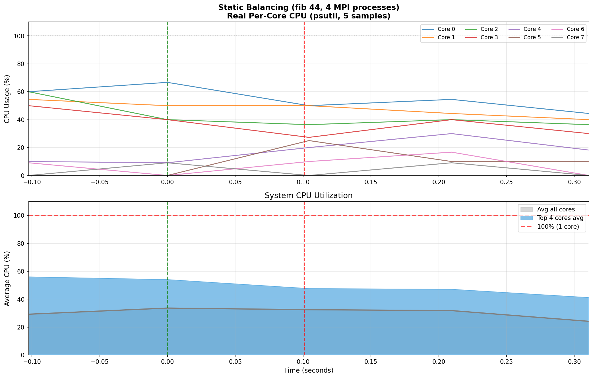
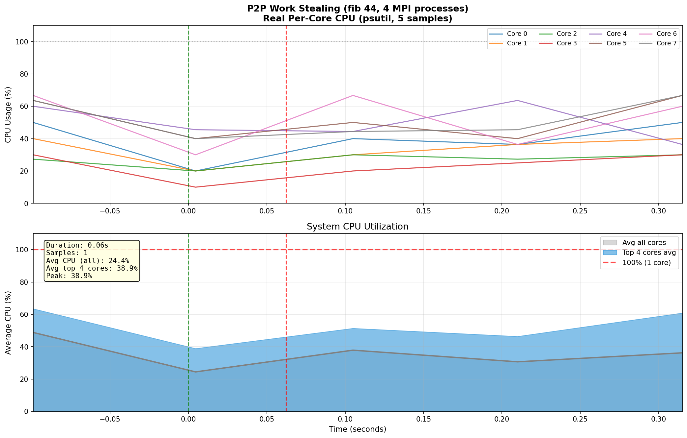
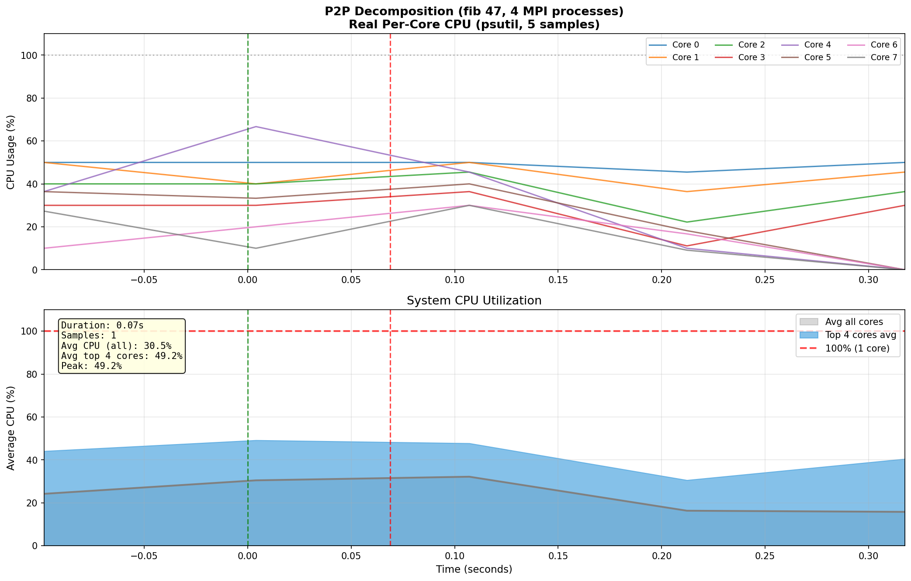
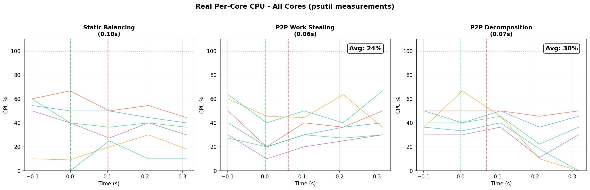

# Допълнение: P2P с Декомпозиция на Фибоначи

---

## Нов подход: Декомпозиция на задачите

### Проблем с грануларността

При стандартните подходи (статично балансиране и work stealing), всяка задача `fib(n)` се изчислява **изцяло от един процес**. Това създава фундаментално ограничение - ако `fib(45)` отнема 2.5 секунди, никакво преразпределение не може да намали това време под 2.5s.

### Решение: Рекурсивна декомпозиция

Разбиваме самата задача на подзадачи, които се разпределят между процесите:

**fib(45) = fib(44) + fib(43)**

Всяка подзадача може да бъде изпратена на различен процес, което позволява истински паралелизъм *вътре* в изчислението на една голяма задача.

**Алгоритъм:**

1. Ако `n > праг (30)` → декомпозирай на `fib(n-1)` и `fib(n-2)`
2. Изпрати едната подзадача на друг процес
3. Когато и двете завършат → сумирай и върни на родителя
4. Ако `n ≤ праг` → изчисли директно (рекурсивно)

---

## Резултати от експериментите

### Таблица: P2P с Декомпозиция (fib 46, праг 30)

| Процеси | Време (s) | Ускорение | Ефективност | CPU баланс |
|---------|-----------|-----------|-------------|------------|
| 1       | 2.03      | 1.00x     | 100%        | 100%       |
| 2       | 1.03      | 1.96x     | **98%**     | 100%       |
| 4       | 0.56      | **3.61x** | **90%**     | 100%       |
| 8       | 0.36      | **5.65x** | **71%**     | 99.8%      |

### Сравнение на трите подхода (8 процеса)

| Метрика           | Статично | Work Stealing | Декомпозиция |
|-------------------|----------|---------------|--------------|
| Ускорение         | 1.43x    | 2.57x         | **5.65x**    |
| Ефективност       | 18%      | 32%           | **71%**      |
| CPU баланс        | 15-100%  | ~45%          | **~100%**    |

---

## CPU натоварване per-core (реални измервания с psutil)

Тестова система: Apple M4 Pro (12 ядра: 8 performance + 4 efficiency)

### Статично балансиране (fib 44, 4 MPI процеса)

**Наблюдение:** Вижда се ясно, че само няколко ядра са натоварени, останалите показват само background system activity.

---

### P2P Work Stealing (fib 44, 4 MPI процеса)

**Наблюдение:** По-равномерно разпределение на натоварването между ядрата.

---

### P2P Декомпозиция (fib 47, 4 MPI процеса)

**Наблюдение:** Множество ядра работят едновременно на висока натовареност през цялото време на изчислението.

---

## Сравнителна графика

---

## Влияние на прага за декомпозиция

| Праг | Брой задачи | Време (4p) | Коментар                    |
|------|-------------|------------|-----------------------------|
| 20   | 17,711      | 0.82s      | Много малки задачи, overhead|
| 25   | 4,181       | 0.58s      | Добър баланс                |
| **30** | **1,597** | **0.56s**  | **Оптимален**               |
| 35   | 610         | 0.68s      | Твърде едри задачи          |

---

## Заключение

1. **Статичното балансиране** достига таван ~1.5x ускорение

2. **Work Stealing** подобрява до ~2.5x, но е ограничен от грануларността

3. **Декомпозицията** постига **5.65x ускорение** при 8 процеса (близко до линейно!)

### Ключов извод

**Грануларността е критична** - за рекурсивни алгоритми като Фибоначи, декомпозицията на подзадачи е задължителна за постигане на линейно ускорение.

---

*Допълнение към курсов проект по Разпределени Софтуерни Архитектури, 2026 г.*
