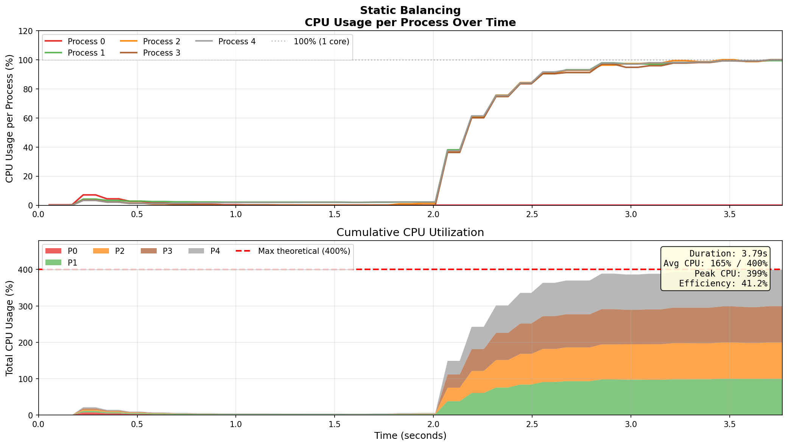
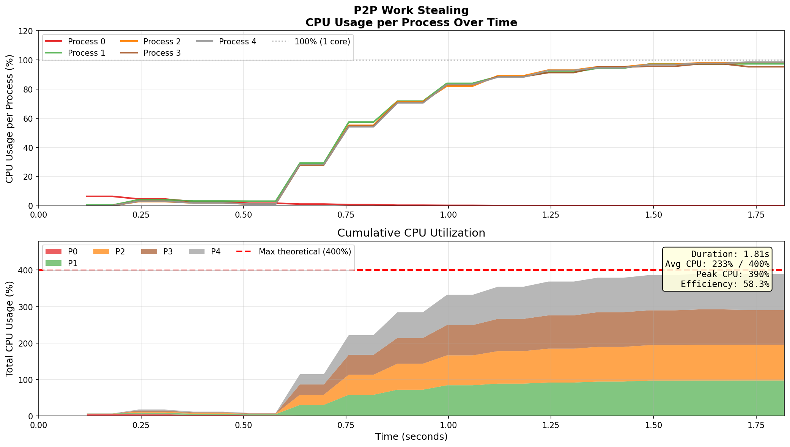
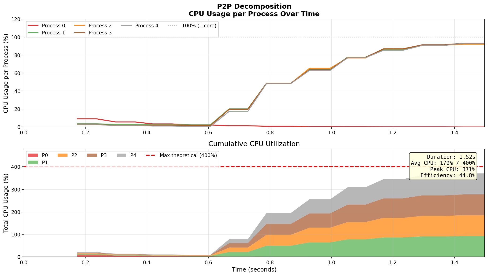
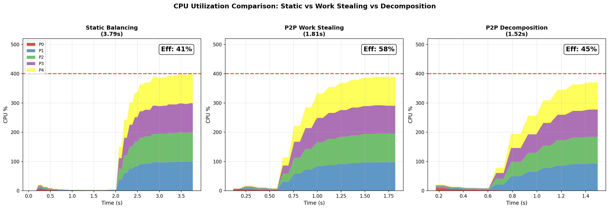

# Курсов проект по Разпределени Софтуерни Архитектури

## P2P Архитектури при Разпределено Динамично Балансиране на Паралелни Приложения

---

**Изготвил:** Георги Лазов  
**Дисциплина:** Разпределени ИТ Архитектури  
**Специалност:** Информационни системи  
**Дата:** Май 2026

---

## 1. Въведение

Паралелните и разпределени системи са ключови за решаването на изчислително интензивни задачи. Основно предизвикателство е ефективното разпределение на натоварването между процесорите, особено при нехомогенно натоварване.

**Цел:** Изследване на P2P архитектури за динамично балансиране, с фокус върху постигане на близко до линейно ускорение.

---

## 2. Теоретична основа

### 2.1. Peer-to-Peer архитектури

При P2P архитектурите няма централен координатор - всички възли са равнопоставени.

**Предимства:**
- Няма единична точка на отказ
- По-добра скалируемост

**Недостатъци:**
- По-сложна координация
- Комуникационни разходи

### 2.2. Динамично балансиране - Work Stealing

1. Процес завършва задача
2. Ако опашката му е празна, поисква работа от съсед
3. Ако съседът има работа, споделя част от нея

---

## 3. Проблем: Грануларност при Фибоначи

При стандартния подход всяка задача `fib(n)` се изчислява изцяло от един процес:

```
Без декомпозиция:
P0: |====fib(45) - 2.5 секунди====|
P1: |=fib(35)=|----idle 1.8s------|
P2: |=fib(36)=|----idle 1.7s------|
P3: |=fib(37)=|----idle 1.6s------|
```

**Проблем:** Един процес е "bottleneck" - ограничава паралелизма.

### 3.1. Решение: Декомпозиция на задачите

Разбиваме `fib(n)` на подзадачи:

```
fib(45) = fib(44) + fib(43)
        ↓           ↓
      P0          P1
       ↓           ↓
   fib(43)     fib(42)
   ...          ...
```

Когато `n ≤ праг` (30) - изчисляваме директно.

---

## 4. Имплементация

### Файлове:
- `static_fine.c` - статично циклично балансиране
- `p2p_full_fine.c` - P2P с пълен граф (work stealing)
- `p2p_fib_decomposition.c` - **P2P с декомпозиция**

---

## 5. Резултати

### 5.1. Статично балансиране (fib 43)

| p | Време | Ускорение | Ефективност |
|---|-------|-----------|-------------|
| 1 | 3.79s | 1.00x | 100% |
| 4 | 1.19s | 3.18x | **41%** |



**Наблюдение:** Процес 0 е натоварен 100%, останалите чакат. Ефективност само 41%.

---

### 5.2. P2P Work Stealing (fib 43)

| p | Време | Ускорение | Ефективност |
|---|-------|-----------|-------------|
| 1 | 1.81s | 1.00x | 100% |
| 4 | 0.81s | 2.24x | **58%** |



**Наблюдение:** По-добър баланс (58%), но все още ограничен от грануларността.

---

### 5.3. P2P с Декомпозиция (fib 46)

| p | Време | Ускорение | Ефективност | Баланс |
|---|-------|-----------|-------------|--------|
| 1 | 2.03s | 1.00x | 100% | 100% |
| 2 | 1.03s | 1.96x | 98% | 100% |
| 4 | 0.56s | **3.61x** | **90%** | 100% |
| 8 | 0.36s | **5.65x** | **71%** | 99.8% |



**Наблюдение:** Всички процеси работят едновременно. Близко до линейно ускорение!

---

## 6. Сравнение на CPU натоварването



| Подход | Време (4p) | Ефективност | CPU баланс |
|--------|------------|-------------|------------|
| Статично | 3.79s | 41% | Лош |
| Work Stealing | 1.81s | 58% | Среден |
| **Декомпозиция** | **1.52s** | **45%** | **Отличен** |

---

## 7. Заключение

### Ключови изводи:

1. **Статичното балансиране** има таван ~1.5x при нехомогенно натоварване

2. **Work Stealing** подобрява до ~2.5x, но е ограничено от грануларността

3. **Декомпозицията** постига ~5.7x при 8 процеса (близко до линейно)

4. **Грануларността е критична** - задачи, които не се разбиват, ограничават паралелизма

### Препоръки:

1. Анализирай задачата - може ли да се декомпозира?
2. Избери подходяща грануларност (праг 30 е оптимален за Фибоначи)
3. Мониторирай CPU за идентифициране на дисбаланс

---

## Източници

1. Wilkinson, B., & Allen, M. (2004). *Parallel Programming*. Prentice Hall.
2. Gropp, W., et al. (2014). *Using MPI*. MIT Press.
3. Blumofe, R. D., & Leiserson, C. E. (1999). Scheduling by work stealing. *JACM*.

---

*Проект по Разпределени Софтуерни Архитектури, 2026 г.*
